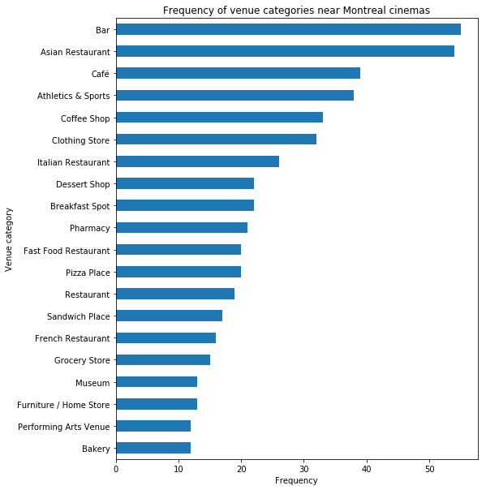

# Expansion project near Cinema Guzzo

## Business Problem

Cinema Guzzo Mega-Plex Sphèretech 14 in Ville Saint-Laurent, Montreal, Canada is
looking to expand! In the mall where the cinema is situated, a new empty spot is
available for a business. Cinemas are busy places, and choosing the right
business close to a cinema could be very lucrative. But how to choose which type
of commerce would be best? A café? A restaurant? Some entertainment like an
escape room type of venue?

The stakeholders of Cinema Guzzo want a report on what type of commerce works
well around other cinemas in the city so that they can start one of the same
type in the mall. There would be even more chances of success if it is a
commerce type lacking in the current mall.

## Available Data

### List of cinemas in Montreal

The _Foursquare API_ has been used to search the location of cinemas in
Montreal. A query using the `search` endpoint with `intent` set to `browse` and
an appropriately-set `categoryId` parameter provides the id, name and location
of all cinemas in Montreal.

An example of response from _Foursquare_'s `search` endpoint can be found here:
<https://developer.foursquare.com/docs/api/venues/search>.

### Popular businesses close to cinemas

The `explore` endpoint of the _Foursquare API_ has been used to search for
popular businesses in a given location. The locations come from the previous
`search` query.

By setting the `section` parameter to `nextVenues`, we get the venues frequently
visited after the given venue, that is, places where people go after going to
the specified cinema, in a close radius. A radius of 600 meters was used.

The response provides, among other things, those venues' ids and categories. An
example of response from _Foursquare_'s `explore` endpoint can be found here:
<https://developer.foursquare.com/docs/api/venues/explore>.

### Venue categories

The `categories` endpoint of the _Foursquare API_ has been used to collect all
existing venue categories in the _Foursquare_ system into python dictionaries
for easier access.

The categories are organized hierarchically, as can be seen on the full category
list here: <https://developer.foursquare.com/docs/resources/categories>

The response also provides subcategories for each category. An example of
response from _Foursquare_'s `categories` endpoint can be found here:
<https://developer.foursquare.com/docs/api/venues/categories>.

## Methodology

### Popular categories

Once all the data was acquired from _Foursquare_, the first step was to clean
the data and reformat it to be processable. Specifically, the most popular venue
categories needed to be determined.

The `explore` endpoint, once cleaned up, provides a list of venues and their
category IDs for each cinema in Montreal. The ID is OK, but having a name is
more legible, so the dictionary generated using the `category` enpoint was used
to retrieve category name and hierarchy level.

All cinemas (except Sphèretech) were then aggregated to generate the global
frequency for all venue categories. At that point, we realized that some
categories were very specific, so much so that it was diluting the underlying
category.

For example, there are 13 sushi restaurants, 9 vietnamese restaurants, 8 korean
restaurants... Because the categories are too specific, the general _asian
restaurant_ category's importance was underestimated.

The next step was to use top-level categories instead to agglomerate the venues
into broader categories, like _asian restaurants_.

### Average cinema

For each cinema, the venues were summarized into a histogram of the top-level
categories. At that point, it was possible to know, for a given cinema, the
number of venues of a given popular top-level category in the cinema's vicinity.

The category frequencies were then averaged among all cinemas except Sphèretech
to generate the category frequencies for the _average cinema_.

### Exploratory statistics

The category frequencies for both the Sphèretech cinema and the average cinema
were compared using basic statistics and data visualization. A modified box plot
was generated to compare the number of venues of a given category for Sphèretech
and the first and third quartiles of the other cinemas.

### Recommendation and recommender systems

At that point, a recommender system was trained using the available data, in the
hope of getting useful category recommendations for a new business near
Sphèretech, based on Montreal's other cinemas. Unfortunately, results were
deemed unsatisfactory. See the _Discussion_ section below for a possible
explanation.

In the end, inspection of the box plot was used to make recommendations
concerning the business categories with the highest potential.

## Results

### Popular categories

The specific categories were grouped into top-level categories. The figure below
shows the 20 most frequent top-level categories around Montreal's cinemas.

### Average cinema

Exploratory statistics were used to generate a global picture of the top-level
categories around Montreal's cinemas.

### Comparison between Sphèretech and the other cinemas

The box plot below shows the frequency of top-level venue categories around
cinemas. The blue boxes in the figure thus span from the first quartile to the
third quartile of cinemas, that is, the middle half. This is a nice target for
Sphèretech to be in.

Red translucent bars were added to show where Sphèretech currently stands
compared to the other cinemas.

Comparison with the average cinema is also available in tabular format. Only the categories where Sphèretech is lacking have been kept in the table below.

## Discussion

When comparing Sphèretech against the other cinemas using the box
plot, we can recommend with a high degree of confidence that a business in one
of the following three categories would be popular:
- a café,
- an italian restaurant,
- or a bar.

The first two recommended businesses, café and italian restaurant, are currently
not available in Sphèretech's mall, so there would be no real competition. There
is currently a bar near Sphèretech, but we still recommend establishing a bar,
because the average cinema has more than 2 bars close by, so we think it would
also be successful.

The above recommendations were obtained by inspection. A recommender system was
used, but deemed unsatisfactory. This is possibly due to the fact that
businesses don't behave like, say, movies. If a person likes action movies, we
can always recommend more action movies, whereas if there is already multiple
asian restaurants near a cinema, maybe it is a bad idea to add one more.

An alternative avenue would be to build a predictive model of how successful a
venue is depending of the amount of venues of different categories around it. To
do so, more data would be needed to get a metric of business success, for
example, current business revenues or the history of businesses that went
bankrupt.

## Conclusion

Cinema Guzzo's stakeholders asked to determine some business categories that
would be likely to thrive, were they to expand around the current Sphèretech
cinemas.

Using the _Foursquare API_, statistics were used to generate the average cinema
profile. Using that information, we conclude that one of the three following
categories would have a higher success rate:
- a café,
- an italian restaurant,
- or a bar.
